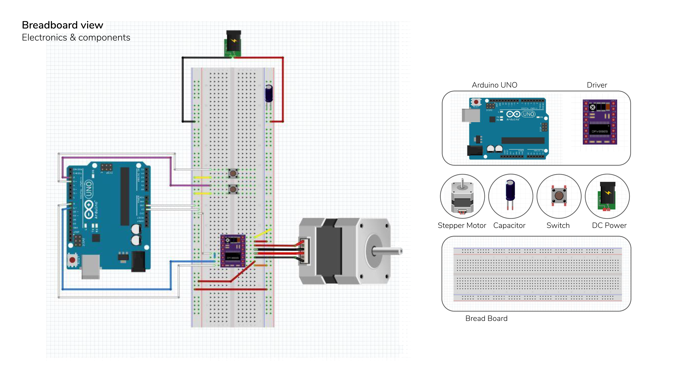

# Bender
End effector for ABB 140 for bending aluminium controlling degree

The process of bending metal has always been a hard and an accurate process to do by hand, therefore adding this craftsmanship to the robot expect precise learning, prototyping and calculations.

By looking on the typical tools used for the same reason at the present we were able to learn some techniques used for bending metal sheets.
And then we set some goals to be achieved with the new tool we are going to build.

And as a very early start, a prototype was built to grip and bend. However, the imperfection in controlling the crease position and the angle of bending made us believe that this tool needs a comprehensive change.

Despite the good intentions and the hard work, the tool didn't match the target.

Therefore, A change in the design and strategy took place from the previous experiment and a new design was made to achieve the wanted target from the tool.

_Bender_ is a project of __IaaC__, Institute for Advanced Architecture of Catalonia. developed at Master in Robotics and Advanced Construction in 2019-2020 by:

<dl>
  
__Students:__
 <dl>
<dp>Abdelrahman Koura</dp>
<dp>Amit Pattar</dp>
<dp>Jun Woo Lee</dp>
<dp>Lorenzo Masini</dp>
<dp>Luis Jayme</dp>
  </dl>
  </dl>
  
__Faculty:__
_Angel Muñoz
Irene Rafols
Soroush Garivani_

